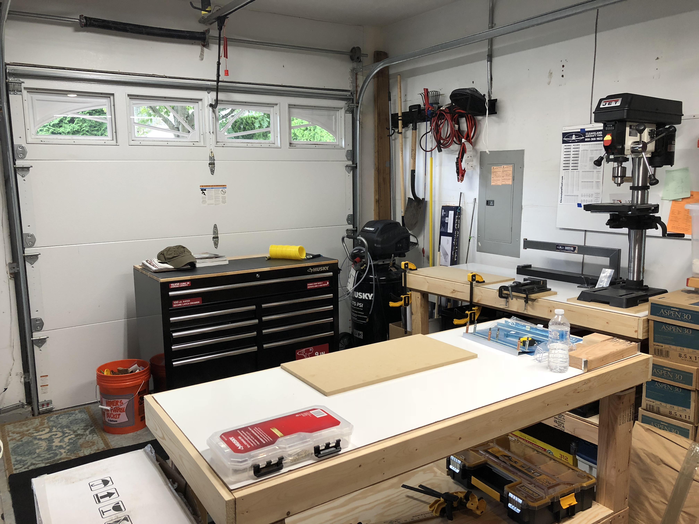
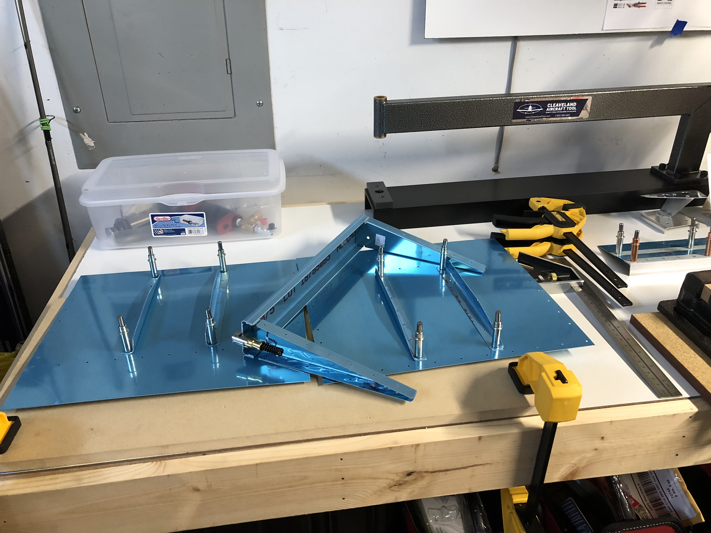

## Where To Start

In order to get started on building the RV9, you're going to need a couple things. A workshop with enough space to assemble the parts, the tools to assemble the parts, and the parts themselves.

### Tools

The tools you need are included in the following image

### Workshop

In order to begin building the RV9, you're going to need a semi-medium workshop, with enough space to measure the parts, and cut them. The following image would be an example of it

### Parts

In order to build the plane you're going to need the parts. Hop on google and search up RV9 parts or the blueprints for it. After you've acquired it from a free download or purchase, measure sheets of metal out, draw the parts on them, and cut them out. An example of the parts would be this

