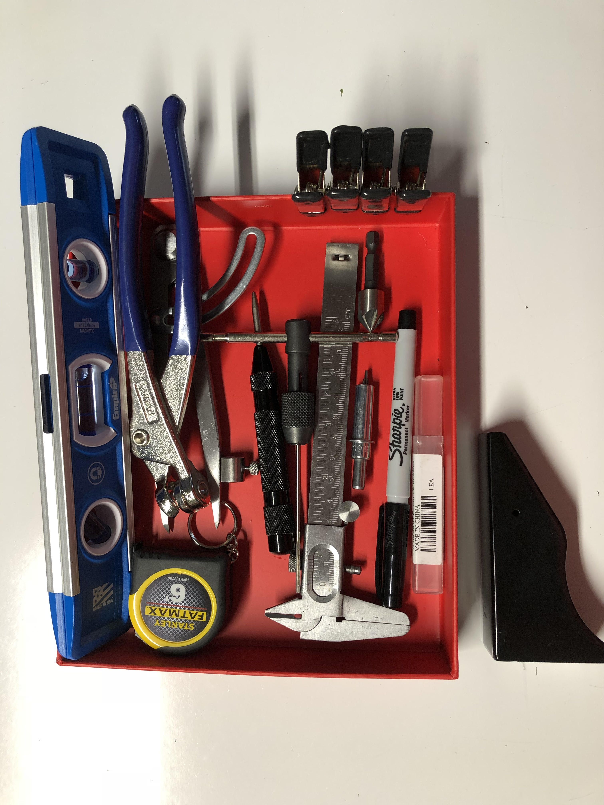

## Where To Start

In order to get started on building the RV9, you're going to need a couple things. A workshop with enough space to assemble the parts, the tools to assemble the parts, and the parts themselves.

### Tools

The tools you need are included in the following image

### Jekyll Themes

Your Pages site will use the layout and styles from the Jekyll theme you have selected in your [repository settings](https://github.com/eightman-design/RV9-Building/settings). The name of this theme is saved in the Jekyll `_config.yml` configuration file.

### Support or Contact

Having trouble with Pages? Check out our [documentation](https://docs.github.com/categories/github-pages-basics/) or [contact support](https://github.com/contact) and we’ll help you sort it out.
